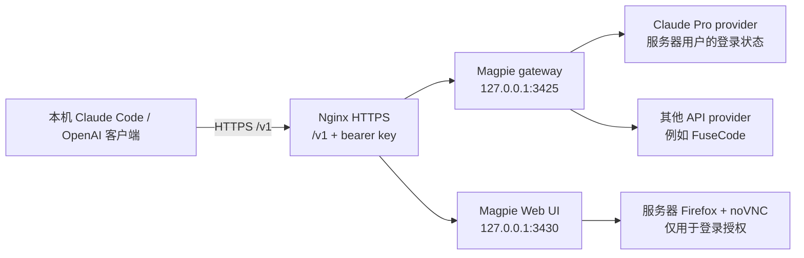

# 用远程服务器上的 Magpie 承载 Claude Pro，本机直接调用

这份笔记整理了一次实际部署：在一台独立的 AlmaLinux VPS 上运行 Magpie，把 Claude Pro 订阅登录在服务器自己的用户和浏览器中；本机只访问 Magpie 的 HTTPS 网关，因此本机不需要登录 Claude，也不需要携带服务器上的 Claude 凭据。

文中的端口、服务路径和故障现象来自 2026-09-28 的一次部署记录。Magpie、Claude Code 和发行版会更新，执行前请先查看当前版本的帮助和官方文档。所有主机名、密钥、账号和 IP 都使用占位符。

## 1. 先理解数据流



服务器上至少有三类相互独立的状态：

| 状态 | 用途 | 应该放在哪里 |
|---|---|---|
| Magpie Web 会话 | 打开管理页面、供应商设置和远程浏览器入口 | 浏览器 cookie / Web 登录密钥 |
| Magpie 网关 bearer key | 本机向 `/v1` 发模型请求 | 本机密钥管理器和服务器受限文件 |
| Claude Code 或 Codex 登录状态 | 代表服务器上的 Claude Pro 订阅调用 Claude | 服务器上运行 Magpie 的专用用户目录 |

登录 Magpie Web 不会自动授权 API 网关；本机也不需要拥有第三类凭据。请求必须经过 Magpie 网关，才会使用服务器上的订阅账号。

## 2. 准备服务器

推荐使用独立的 Linux VPS。1 GB 内存可以运行轻量 Magpie 网关，但服务器端 Firefox、Xvnc、Websockify 和 noVNC 会明显增加内存压力。先准备 swap，并观察内存；swap 只能缓冲峰值，不能代替更大的内存。

以 AlmaLinux 9 为例，先完成系统更新、普通用户和 SSH 密钥登录。确认新用户可以登录后，再关闭 root 密码登录：

```bash
sudo dnf update -y
sudo dnf install -y curl wget git vim htop

# 在本机生成并安装密钥；不要把密码写进命令行或聊天
ssh-keygen -t ed25519
ssh-copy-id <USER>@<SERVER_HOST>

# 确认密钥登录成功后，再配置 sshd
sudo tee /etc/ssh/sshd_config.d/00-hardening.conf >/dev/null <<'EOF'
PermitRootLogin no
PasswordAuthentication no
PubkeyAuthentication yes
MaxAuthTries 3
AllowUsers <USER>
EOF
sudo sshd -t && sudo systemctl restart sshd
```

防火墙只放行 SSH、HTTP（证书签发）和 HTTPS。Magpie 的 3425、3430，以及 VNC/noVNC 端口保持回环监听，不要直接暴露到公网。服务器操作应通过受管的 SSH 工具和操作系统凭据库完成。

## 3. 安装并运行 Magpie

在服务器安装官方 Linux 版本，安装命令以当前上游文档为准：

```bash
curl -fsSL https://usemagpie.ai/install.sh | sh
magpie --version
magpie --help
```

使用专用服务用户运行 Magpie，例如 `magpie`，并确保它的 `HOME` 指向实际服务目录：

```bash
sudo -u magpie env HOME=/var/lib/magpie magpie --version
```

这是一个容易踩坑的地方：用 root 运行 CLI 看到的是 `/root` 的配置，用 `magpie` 服务运行才会看到 Web 服务真正使用的供应商和登录状态。

建议让 Web UI 和网关只监听服务器本机，典型端口为：

```text
127.0.0.1:3430  Magpie Web UI
127.0.0.1:3425  Magpie API gateway
```

用 systemd 管理 Web 服务，升级时先记录当前版本和 unit，再替换二进制、重启并检查监听地址和 HTTP 状态。不要把管理密钥或网关密钥写入 systemd 日志。

## 4. 用 Nginx 提供 HTTPS 和两层认证

Nginx 可以把公网 HTTPS 请求转发到回环端口：

```text
https://<SERVER_HOST>/       -> 127.0.0.1:3430
https://<SERVER_HOST>/v1/    -> 127.0.0.1:3425
```

推荐的访问边界是：

- Web UI、登录辅助页和 `/browser/` 先经过 Magpie Web 会话检查。
- `/v1/` 使用独立的 bearer key。Web UI 登录 cookie 不能代替它。
- noVNC 的 WebSocket 路径也必须经过同一层访问检查。
- 对外开放 443 不等于允许匿名访问；仍要定期从无 cookie、无 bearer key 的环境检查是否返回 `401`。

证书可以使用域名证书或服务商支持的 IP 证书，并配置自动续期。Nginx 配置中的密钥只允许 root 读取；不要把完整配置、访问链接或密钥放到 issue、截图、日志和 Git 仓库。

## 5. 在服务器自己的浏览器里登录 Claude

如果目标是让本机完全不接触 Claude 登录状态，登录必须发生在服务器上。可在服务器启动 Firefox + Xvnc + Websockify/noVNC，且全部后端只监听回环地址；Nginx 在已有 Magpie 会话后面暴露一个临时的 `/browser/` 入口。

推荐流程：

1. 登录 `https://<SERVER_HOST>/` 的 Magpie Web UI。
2. 打开服务器浏览器入口，例如 `https://<SERVER_HOST>/browser/vnc.html?autoconnect=true&resize=scale`。
3. 在远程 Firefox 中完成 Claude 登录、MFA、授权和验证码。
4. 确认 Claude Code CLI 也在同一个服务器用户下完成登录。
5. 回到 Magpie 的 **Providers** 页面，刷新模型列表，确认出现 `claude/<model>`。

仅在网页里完成 OAuth 还不够。如果 Magpie 依赖 Claude Code 的凭据文件，CLI 必须以 Magpie 的运行用户登录；否则会出现“账号已授权，但找不到 credentials 文件”或 provider `active: false`。

服务器浏览器应按需启动，并设置运行时限。1 GB VPS 上 Firefox 曾导致 noVNC 进程被 OOM 杀掉；遇到 502 或“无法连接服务器”时，先检查 Firefox、Xvnc、Websockify、内存和 OOM 日志，再检查 Nginx 的 WebSocket 代理。

不要让用户把密码、验证码、授权 code 或 `auth.json` 发到聊天里。本机看到的只是远程画面和输入通道，不会把本机浏览器 cookie 自动带到服务器。

## 6. 添加其他 provider 和检查模型

API key provider 在 **Providers → Add a provider** 中添加，使用 HTTPS base URL，并让 Magpie 自动发现模型。模型名通常是：

```text
<provider>/<model>
```

保存后检查模型列表和协议。一个供应商可能同时支持 OpenAI、Anthropic 或 Responses API；本机客户端要按 Magpie 的当前 Gateway/Client setup 页面选择对应的变量，不要凭旧版本示例猜测。

## 7. 本机调用服务器上的模型

### OpenAI 兼容客户端

把本机客户端的 base URL 指向服务器的 `/v1`，API key 使用网关 bearer key：

```bash
export OPENAI_BASE_URL="https://<SERVER_HOST>/v1"
export OPENAI_API_KEY="<MAGPIE_GATEWAY_KEY>"
```

最小检查可以只验证模型列表，不要把响应中的密钥或完整配置打印出来：

```bash
curl -fsS \
  -H "Authorization: Bearer ${OPENAI_API_KEY}" \
  "${OPENAI_BASE_URL}/models"
```

### Anthropic 协议或 Claude Code

从 Magpie 的客户端配置页面复制当前版本所需的变量。一次部署中使用过的形状是：

```bash
export ANTHROPIC_BASE_URL="https://<SERVER_HOST>"
export ANTHROPIC_AUTH_TOKEN="<MAGPIE_GATEWAY_KEY>"
```

然后在本机 Claude Code 中选择 Magpie 暴露的模型。固定 provider 模型通常形如 `claude/<model>`；路由组通常形如 `group/<group-id>`。具体模型 ID 以 Magpie 当前 **Models** 页面为准。

这一步只让本机成为网关客户端。本机不需要执行 Claude 登录，也不需要复制服务器上的 Claude 凭据文件。

## 8. Provider fallback 和路由组不是一回事

这是一次部署中最容易误解的地方：

- 请求 `claude/claude-opus-5-5` 时，Magpie 会先选择 Claude provider。
- 给 Claude provider 配置 fallback 后，只有在额度耗尽、限流或 provider 故障等条件触发时才会改用备用模型。
- 请求 `group/auto-claude-opus-5-5` 时，Magpie 才会在该组的多个 provider/model 之间选择。
- 如果客户端绕过 Magpie，直接连接 Claude，任何 fallback 或路由组都不会生效。

Fallback 可以在 **Providers → Claude Code → Fallback** 编辑。CLI 命令随版本变化，某次部署中使用过：

```bash
magpie provider fallback claude fusecode/claude-opus-5-5
```

执行前先运行 `magpie --help`，并用服务用户和正确的 `HOME` 操作。固定 fallback 到 Opus 意味着原来请求 Sonnet 或 Haiku 的请求在回退时也可能改用 Opus；如果希望按模型家族选择，使用合适的路由组或分别配置 fallback。

## 9. 常见故障定位

| 现象 | 优先检查 |
|---|---|
| `/v1/models` 返回 `401` | bearer key、Nginx `/v1/` 代理和路径是否带 `/v1` |
| Web UI 能打开但 API 失败 | Web 会话和网关 bearer key 是两套认证 |
| provider 不出现 | 是否以 Magpie 服务用户运行；`HOME` 是否正确；CLI 登录状态是否写入该用户目录 |
| noVNC 返回 502 或无法连接 | 浏览器/Xvnc/Websockify 是否退出、OOM、Nginx WebSocket 配置和 Magpie 会话 cookie |
| Claude 额度耗尽却没有切换 | 客户端是否发给 `claude/<model>`；provider fallback 是否配置；请求是否经过 Magpie |
| 模型数量为 0 | 刷新模型目录，检查 provider 的协议和上游 `/v1/models` 响应 |
| 本机能访问但服务器账号不生效 | 本机登录状态不会迁移到服务器；重新在服务器 Firefox 和服务器 CLI 中完成登录 |

## 10. 交付前检查

- Magpie Web、网关、VNC 和 noVNC 后端只监听回环地址。
- Nginx 的 Web UI、登录辅助页和 WebSocket 都有会话检查。
- `/v1` 始终要求独立 bearer key，且 key 不出现在 Git、日志、截图和聊天中。
- Claude 登录状态只存在服务器专用用户目录。
- 已验证本机的最小模型请求确实返回成功，并确认请求经过服务器网关。
- 已先验证 SSH 密钥登录，再关闭 root/密码登录；保留可回滚的管理路径。
- 记录 Magpie、Claude Code、Firefox、noVNC 和系统服务的版本，以便后续升级排障。
